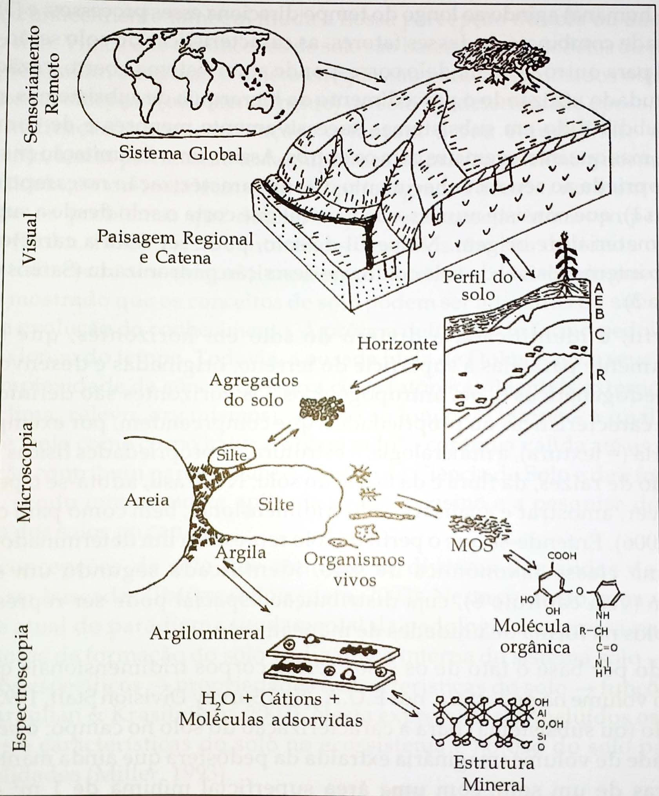
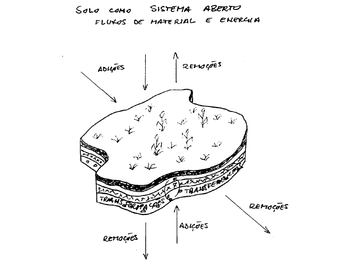
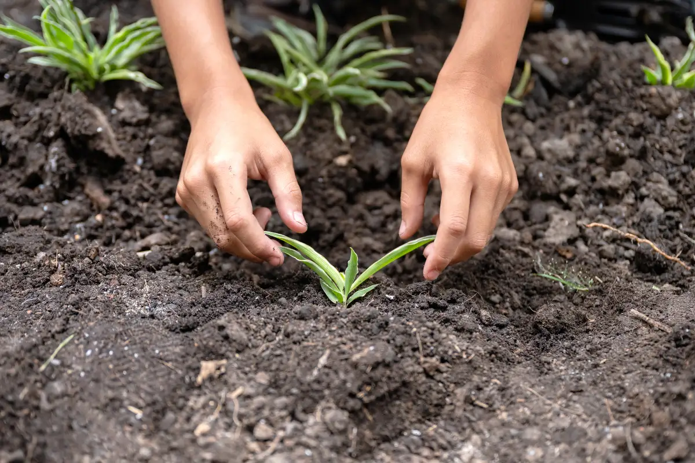
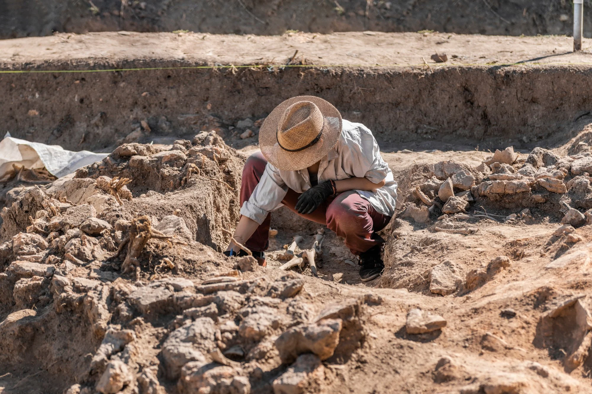
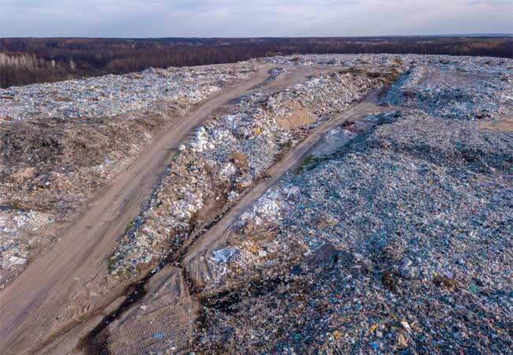
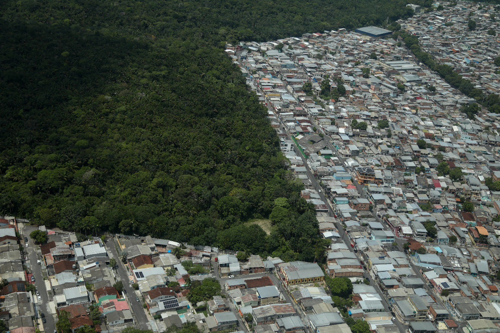
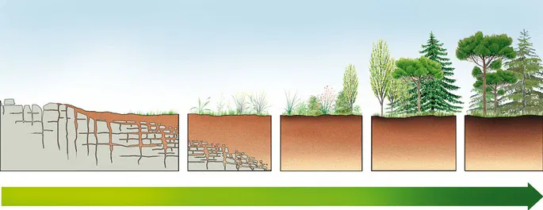
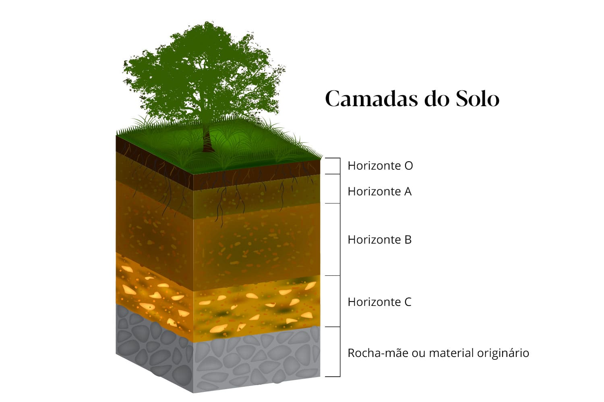
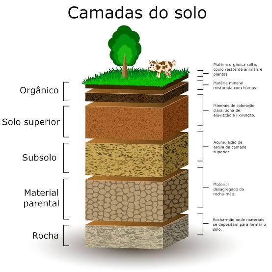
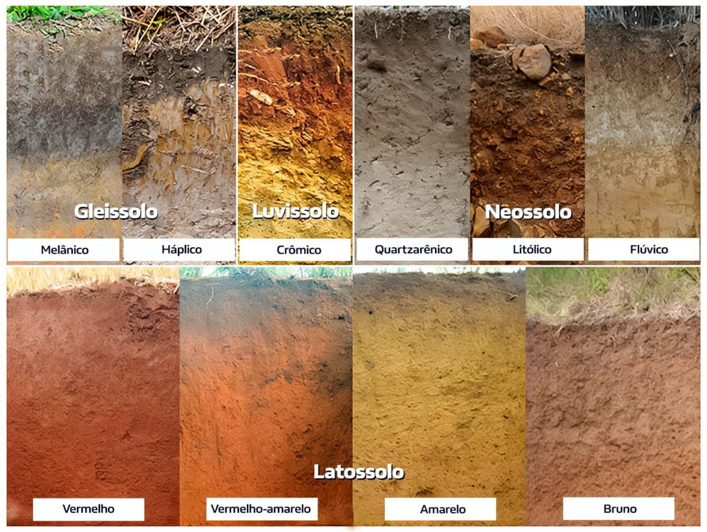

# O que é um solo?

<!-- 

<video
  autoplay
  loop
  muted
  playsinline
  data-autoplay
  style="width:50%;">
  <source src="geoid_GOCO06s.mp4" type="video/mp4">
</video>

 -->

## O que é um solo?

::: {.incremental}

- [__Minha mãe:__]{.fg style="--col: #e64173"} Solo é tudo, porque, se o solo vai bem, nós vivemos bem.

- [__Engenheiro Civil:__]{.fg style="--col: #e64173"} É um material com determinada capacidade de suportar cargas e edificações, rodovias, ou local para instalar fossas sépticas e outros.

- [__Pedólogo:__]{.fg style="--col: #e64173"} É um corpo tridimensional formado na superfície terrestre, por meio da interação dos fatores ambientais agindo ao longo do tempo, varia espacialmente, é resiliente a perturbações, mas é capaz de ser destruído.

- [__Engenheiro Agrônomo:__]{.fg style="--col: #e64173"} É o meio capaz de armazenar e fornecer água e nutrientes para o cultivo de plantas.

:::

::: {.fragment}

O conceito de solo depende da atividade profissional e do modelo conceitual que ele representa em um meio de conhecimento.

:::

## O que é um solo?

Podemos considerar apenas as propriedades do solo ou as suas funções e seus usos para definir.

::: {.incremental}

- Utilitário: Solo como um conjunto de propriedades. Sem preocupação com inter-relações;

- Genético: Propriedades em termos das relações internas;

- Genético-Geográfico: Relações solo-paisagem em grandes áreas;

:::

## O que é um solo?

::: {.incremental}

- Conceito geológico: Solo de granito, solo de basalto.

- Conceito da engenharia: Qualquer material inconsolidado.

- Conceito agrícola:
  - Uso: Solo para trigo, solo para eucalipto.
  - Energia gasta: Solo pesado, solo leve.
  - Pela cor: Solo roxo, solo escuro.

:::

## O que é um solo?

::: {.incremental}

- Aristóteles (384-322 AC) e Theophratus (372-287 AC);
	Consideraram o solos como “edafos” para distinguir de terra e fizeram relações solo X nutrição de plantas de plantas

- Theophratus
	Considerou também seis grupos de “terra” adequado a 	diferentes tipos de plantas

:::

## O que é um solo?

Solo do latim _solum_ (suporte, superfície, base) refere-se à parte superior da crosta terreste ou litosfera, mais precisamente à porção superior do regolito.

## O que é um solo?

> Solo é o corpo natural da superfície terrestre, contituído de materiais minerais e orgânicos resultantes das interações dos fatores de formação (clima, organismos vivos, material de origem e relevo) através do tempo, contendo matéria viva e em partes modificado pela ação humana, capaz de sustentar plantas, de reter água, de armazenas e transformar resíduos e suportar edificações. - Soil Survey Staff, 1975

## O que é um solo?

Evolução do conceito de solo.

::: {.incremental}

- Solo como meio para o desenvolvimento das plantas.

- Solo como regolito.

- Solo como corpo natural organizado.

- Solo como um sistema aberto.

:::

## Solo como meio para o desenvolvimento das plantas

Conceito mais antigo de solo!

::: {.incremental}

- Presume-se que esse conceito tenha se originado no momento em que a humanidade passou da fase caçadora e nômade para fase do cultivo de plantas, formando pequenas comunidades agrícolas.

- Evidências arqueológicas indicam o início da agricultura a certa de 9000 anos na Mesopotâmina, em partes dos atuais Irã e Iraque. Na América, esta transformação teve início no México há menos de 6500 anos.

- Solo usado com o objetico de produzir alimentos e fibras.

:::

## Solo como Regolito ou produto da alteração das rochas

::: {.incremental}

- Para a maioria dos geólogos e engenheiros, o solo é visto como sinônimos de regolito (material solto, inconsolidado, na superfície terrestre, originado pelo intemperismo das rochas no local ou transportado).

- Esse conceito desenvolveu-se no final do século XVIII com a ciência da Geologia.

- Nascimento da designação do solo conforme a rocha que leh deu origem: Solo de granito, solo de basalto, etc.

:::

## Solo como corpo natural organizado

::: {.incremental}

- Surgimento na metade do século XIX. Influência dos avanços do conhecimento em: química (classificação periódica dos elementos, minerais do solo como fonte de nutrientes para as plantas), geologia (mineralogia, petrografica, técnicas de mapeamentos) e a teoria evolucionista de Darwin.

- Representada principalmente pelo russo Vasilii Vasilevich Dokuchaev (1846-1903) (pai da ciência do solo).

- Reconhecimento de que o solo não é apenas o resultado da alteração das rochas, mas sim o produto das interações entre a Litosfera, atmosfera, hidrosfera e a biosfera (fatores de formação do solo).

:::

## Solo como corpo natural organizado

## Solo como sistema aberto

::: {.incremental}

- Base na teoria de sistemas de Ludwig von Bertalanffy (1968): Abordagem filosófica (modelo) que fornece uma estrutura para estudar "sistemas" como entidades em lugar de conglomerados de partes (visão holística).

- Solos são sistemas abertos que trocam energia e matéria com sua circunvizinhança.

- Energia e matéria circulam entre os minerais do solo e as plantas, dos resíduos vegetais para os micro-organismos do solo e destes novamente para os minerais.

:::

## Solo como sistema aberto

{fig-align="center"}

## Solo como sistema aberto

{fig-align="center"}

## O que é um solo?

[__Definição moderna:__]{.fg style="--col: #e64173"}

> SOLO - O material misto sólido, líquido e gasoso horizontado na superfície da Terra, resultante de processos químicos e biológicos e da organização física dos minerais e matéria orgânica que interagem com a atmosfera, litosfera e hidrosfera, e que opera dentro e sustenta ecossistemas terrestres, incluindo biodiversidade, plantas, animais e humanidade. - McBratney A. B. e Hartemink A. E. 2024

## Ciência do solo

::: {.incremental}

- O ramo do conhecimento que estuda o solo.

- Desenvolvida por contribuição de diversas áreas do conhecimento (química, física, geologia, biologia, geografica, agronomia, etc)

- Devido o foco na produção de alimentos, o estudo do solo passou a ser majoritariamente da agronomia ou da área agrícola.

:::

## Ciência do solo

[__Definição moderna:__]{.fg style="--col: #e64173"}

> Ciência do solo é o estudo do solo da Terra e de outros planetas, utilizando teorias e conhecimentos em evolução para entender seu papel na manutenção do funcionamento dos ecossistemas, enfrentando desafios ambientais e apoiando a humanidade. - Hartemink A. E. e McBratney A. B. 2025

## Importância do solo

::: {.incremental}

- Componente vital de processos e ciclos ecológicos.
  - Suporte para plantas.
  - Armazém de nutrientes e água.

- Depósito para acomodar os nossos resíduos.

- Melhorador da qualidade da água.
  - Filtro natural.

- Suporte das infra-estruturas urbanas.

- Meio pelo qual arqueólogos e pedólogos lêem a nossa história.

:::

## Importância do solo

::: {layout-nrow=1}

{width=52%}

{width=50%}

:::

## Importância do solo

::: {layout-nrow=2 layout-ncol="2"}

{width=350px}

{width=350px}

{width=400px}

{width=400px}

:::

# O que é pedologia? 

## O que é pedologia? 

[__Definição:__]{.fg style="--col: #e64173"} É o ramo da Ciência do Solo que trata dos estudos relacionados com a identificação, a formação, a classificação e o mapeamento dos solos.

## O que é pedologia? 

- Origem do solo e suas camadas

## O que é pedologia? 

- Origem do solo e suas camadas

::: {layout-ncol=2}

:::

## O que é pedologia? 

- Tipos de solo

{fig-align="center"}

# Fim!