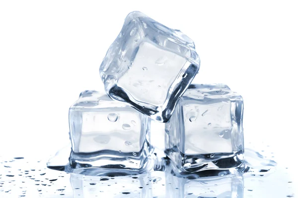
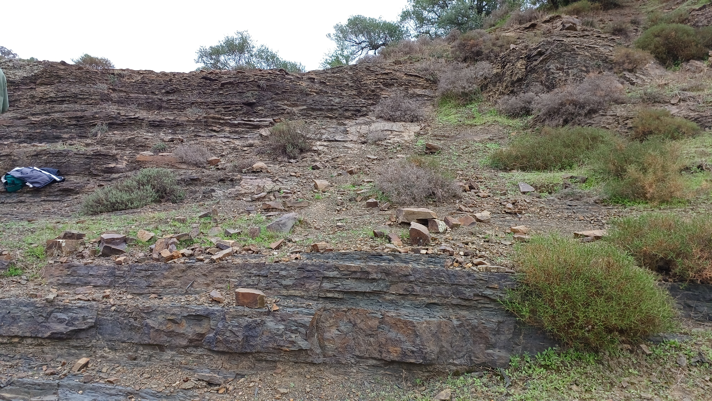

# O que é intemperismo?

## Exemplo

{fig-align="center"}

- Por que o gelo derrete fora do ambiente onde foi criado? (ex: geladeira)

## 

## Intemperismo

 [__Definição:__]{.fg style="--col: #e64173"} É o conjunto de processos físicos, químicos e biológicos que promovem a quebra física e a alteração química das rochas próximas da, ou, na supperfície da crosta terrestre.

{fig-align="center"}

## Intemperismo

 [__Tipos:__]{.fg style="--col: #e64173"}

::: {.incremental}

 - Intemperismo físico
   - Intemperismo físico-termal
   - Intemperismo físico mecânico

 - Intemperismo químico

 - Intemperismo biológico

:::

## Intemperismo físico

É o responsável por fazer com que a rocha original se desintegre em partes menores.

::: {.incremental}

- Não altera a composição mineral e química das partes.

- 

:::