# Como o solo é formado? (pedogênese)
<hr>

::: {.notes}

Que tipo de variáveis são necessárias para a formação do solo?

:::

## Pedogênese
<hr>


::: {.fragment}

Os solos se desenvolvem ao longo do tempo, passando de um estado simples a complexo, até atingirem um estado "maduro" e estável em equilíbrio com o ambiente (sistemas dinâmicos).

:::


::: {.fragment}

O caminho é sempre de um solo jovem para um solo maduro...

:::


# Fatores de formação do solo
<hr>

## Fatores de formação do solo
<hr>

<br>

```{r}
library(DiagrammeR)

grViz(
  "
digraph {

  graph [
    layout = dot,
    rankdir = LR,
    bgcolor = 'transparent',
    margin = 0
  ]

  node [
    shape = circle,
    style = 'filled',
    fillcolor = '#FFFFFF',
    color = '#222222',
    penwidth = 2,
    fontname = 'Arial',
    fontsize = 18,
    width = 1.5,
    height = 1.2,
    fixedsize = true
  ]

  edge [
    color = '#222222',
    penwidth = 2,
    arrowsize = 0.8,
    fontname = 'Arial',
    fontsize = 14,
    labeldistance = 2
  ]

  fatores [label = 'Fatores']
  solos   [label = 'Solos']

  fatores -> solos [
    label = 'Processos pedogenéticos'
  ]
}
",
  width = "100%",
  height = "80%"
)
```


## Fatores de formação do solo
<hr>

Os fatores de formação do solo foram criados pelos estudos de V.V. Dokuchaev no final do século XIX e depois difundidos por Jenny (1941).

::: {.fragment}

Nesse paradigma, o solo passa a ser compreendido como uma função de distintos fatores (variáveis) que, combinados, resultam no solo

:::


::: {.fragment}

$$solo = f(x)$$

:::

::: {.notes}
 
Robert Record, que em 1557 introduziu pela primeira 
vez o símbolo “=” com significado de 
igualdade 

:::

## Fatores de formação do solo
<hr>

 [__Equação de Jenny (1941):__]{.fg style="--col: #e64173"}


::: {.fragment}

 $$ S = f(c,o,r,m,t, ...) $$

:::


::: {.fragment}

Nesse modelo, os fatores ambientais clima ($c$), relevo ($r$), organismos ($o$), material de origem ($m$), e alguns fatores subsidiários não especificados ($...$), interagindo ao longo do tempo ($t$), são as variáveis que condicionam a formação do solo ($S$).

:::

## Fatores de formação do solo
<hr>

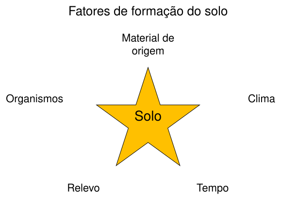{fig-align="center"}

## Fatores de formação do solo
<hr>

[__Fatores passivos:__]{.fg style="--col: #e64173"}


::: {.fragment}

- Material de origem;
- Tempo;
- Relevo;

:::


::: {.fragment}

[__Fatores ativos:__]{.fg style="--col: #e64173"}


::: {.fragment}

- Clima;
- Organismos.

:::


:::

## Fatores de formação do solo
<hr>

[__Material de origem:__]{.fg style="--col: #e64173"}


::: {.fragment}

> É o estado inicial do sistema solo ou é o estado do sistema solo ao tempo zero de sua formação - Jenny, 1941

:::


::: {.fragment}

> É o material do qual o atual perfil de solo foi derivado e, por isso, só pode ser identificado por inferência - Young, 1976

:::


## Fatores de formação do solo
<hr>

[__Material de origem:__]{.fg style="--col: #e64173"}

::: {.incremental}

- O material de origem é a matéria-prima para a formação do solo;
- A formação do solo inicia-se depois que o material de origem não consolidado é depositado ou exposto;
- As propriedades químicas e físicas do material de origem influenciam a natureza do solo formado;

:::

## Fatores de formação do solo
<hr>

[__Material de origem:__]{.fg style="--col: #e64173"}

::: {.incremental}

- Rocha: Basalto, granito, arenito;
- Material não consolidado (sedimentos).
  - Sedimentos marinhos;
  - Fluviais;
  - Lacustres não consolidados;
  - Dunas.

:::

## Fatores de formação do solo
<hr>

[__Material de origem:__]{.fg style="--col: #e64173"}

::: {.incremental}

- Autóctones
  - Quando o solo é formado a partir do material de origem subjacente ao mesmo;
- Alóctone
  - Quando o solo é formado a partir de material de origem que não está subjacente ao mesmo.

:::

## Fatores de formação do solo
<hr>

[__Material de origem:__]{.fg style="--col: #e64173"}

::: {.incremental}

- Formado no local (residual da rocha);
- Transportado;
  - Gravidade;
  - Água (rios, lagos, oceanos);
  - Gelo;
  - Vento;
- Acúmulo de resíduos vegetais.

:::

## Fatores de formação do solo
<hr>

[__Material de origem:__]{.fg style="--col: #e64173"}

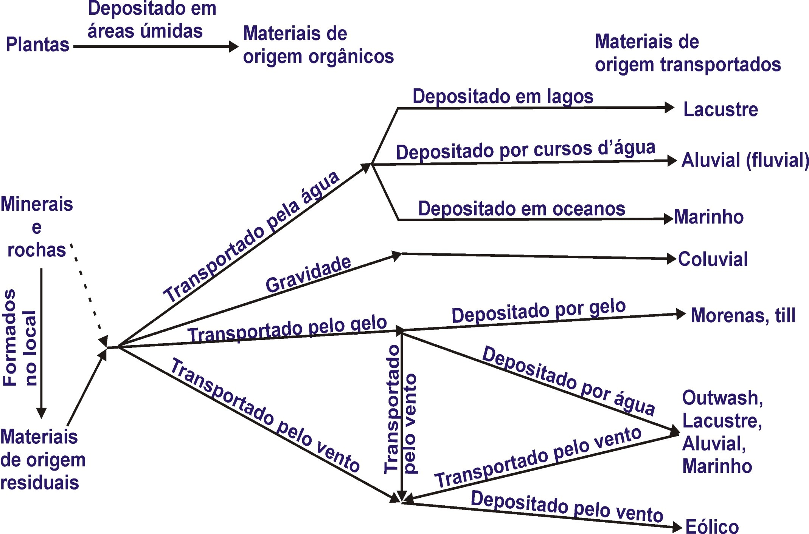{fig-align="center"}

## Fatores de formação do solo
<hr>

[__Material de origem:__]{.fg style="--col: #e64173"}

<br>

| Tipo    | Modo de transporte | Grau de separação por tamanho |
|---------|--------------------|-------------------------------|
| Aluvial | rios               | Alto                          |
| Coluvial| gravidade          | Baixo                         |
| Lacustre| água (lagos)       | Alto                          |
| Residual| nenhum             | -                             |

## Fatores de formação do solo
<hr>

[__Material de origem:__]{.fg style="--col: #e64173"}

Deposições fluviais

::: {layout-nrow=1}

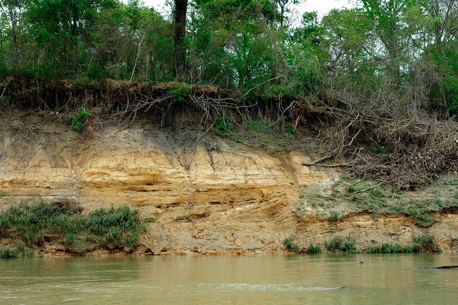{fig-align="center"}

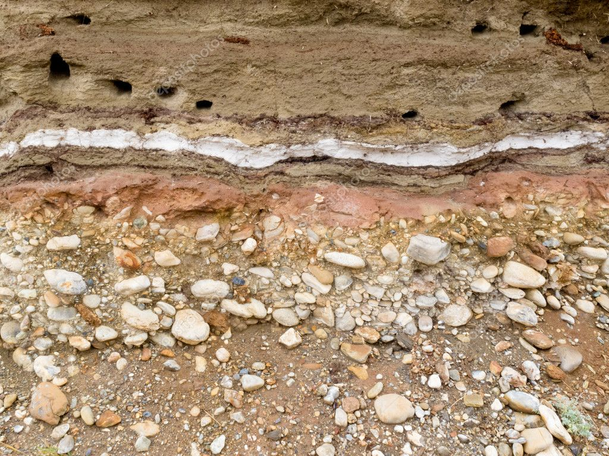{fig-align="center" width="500px"}

:::

## Fatores de formação do solo
<hr>

[__Material de origem:__]{.fg style="--col: #e64173"}

Deposições lacustres

::: {layout-nrow=1}

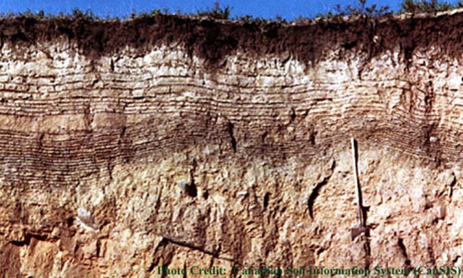{fig-align="center"}

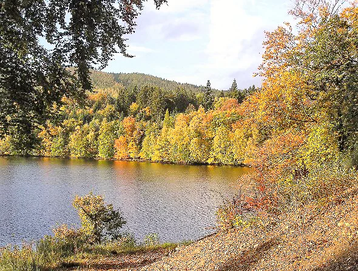{fig-align="center"}

:::

## Fatores de formação do solo
<hr>

[__Material de origem:__]{.fg style="--col: #e64173"}

Deposições eólicas

::: {layout-nrow=1}

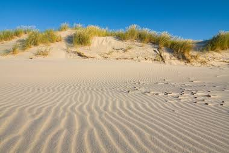{fig-align="center" width="500px"}

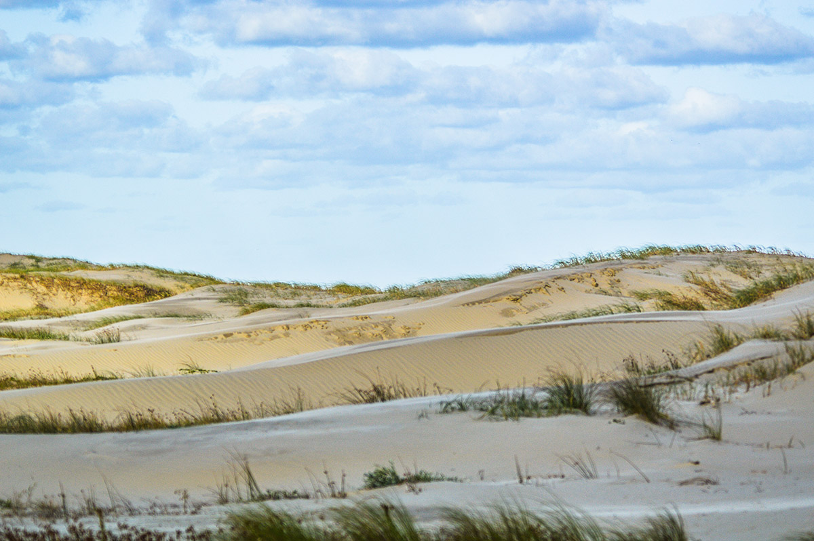{fig-align="center"}

:::

## Fatores de formação do solo
<hr>

[__Material de origem:__]{.fg style="--col: #e64173"}

Deposições coluviais

::: {layout-nrow=1}

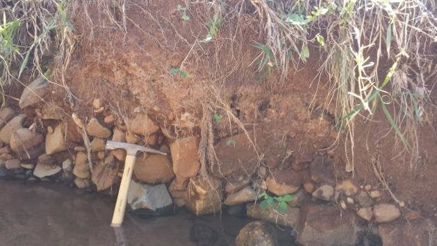{fig-align="center" width="500px"}

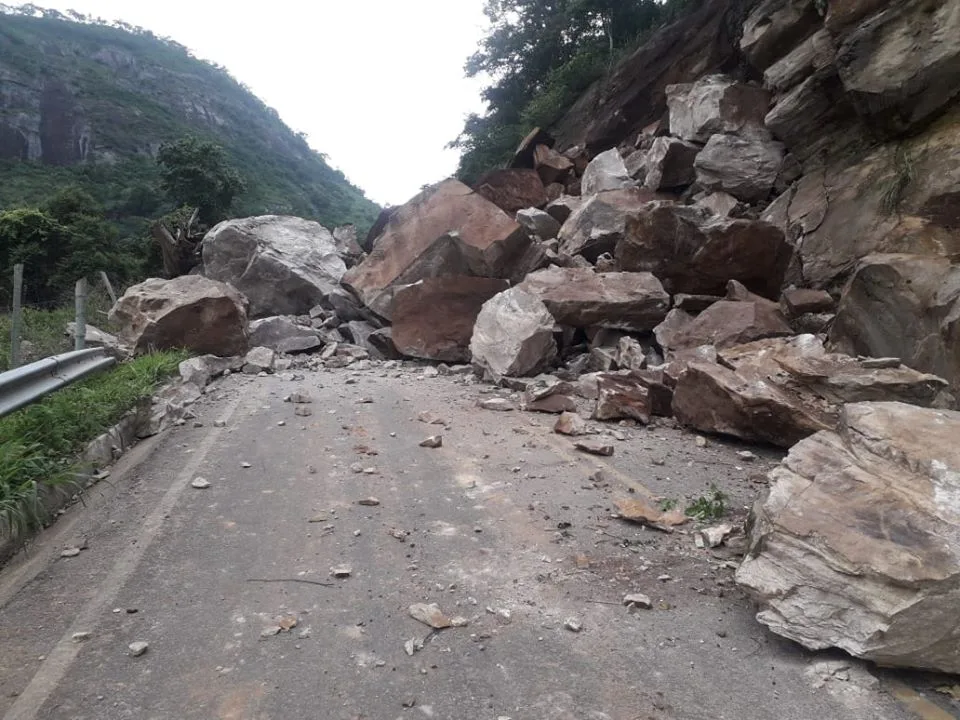{fig-align="center"}

:::

## Fatores de formação do solo
<hr>

[__Material de origem:__]{.fg style="--col: #e64173"}

Características que influenciam a gênese

::: {.incremental}

- Grau de consolidação ("rocha solta");
- Granulação ou textura;
- composição química e mineralógica.

:::

## Fatores de formação do solo
<hr>

[__Material de origem:__]{.fg style="--col: #e64173"}


| Atributos do solo               | Basalto          | Arenito          |
|:--------------------------------|:----------------:|:----------------:|
| Textura                         | + argilosa       | + arenosa        |
| Fertilidade natural             | > CTC            | < CTC            |
| Adsorção de fósforo (P)         | > adsorção de P  | < adsorção de P  |
| Retenção de água                | > retenção de H~2~O | < retenção de H~2~O |
| Área superficial específica (ASE) | > ASE            | < ASE            |


::: {.fragment}

Rochas de textura fina tendem a formar solos de textura fina (argilosos).

:::

## Fatores de formação do solo
<hr>

[__Material de origem:__]{.fg style="--col: #e64173"}

<br>
<br>

::: {style="font-size:24px"}

| Rocha | Ca | K | Fe | Mineralogia da rocha | Argila (g kg$^{-1}$) | Fe (%) | K (ppm) | Mineralogia do solo |
|:-------------:|:--:|:--:|:--:|:--------------------:|:--------------:|:-----:|:-------:|:---------------:|
| Arenito PVA | 0,1 | 0,5 | 2,0 | Quartzo; feldspato | 20 | 1 | 2030 | Kt, Qz, Gt, Hm |
| Granito PVA | 1,6 | 3,6 | 3,0 | Mica; feldspato-K; quartzo | 50 | 3 | 10750 | Kt, Qz, Mi, Gt, Hm |
| Basalto Nitosolo | 4,6 | 1,2 | 9,0 | Piroxênios; anfibólios; plagioclásios | 40 | 14 | 2100 | Kt, Gt, Hm |

:::

## Fatores de formação do solo
<hr>

[__Clima:__]{.fg style="--col: #e64173"}

::: {.incremental}

- Precipitação;
  - Água disponível;
  - Distribuição anual;
  - Evapotranspiração;
  - Topografia;
  - Permeabilidade;
- Temperatura;
- Vento.

:::

## Fatores de formação do solo
<hr>

[__Clima:__]{.fg style="--col: #e64173"}

::: {.incremental}

- A água é o principal agente do intemperismo das rochas e da transformação dos minerais;
- A disponibilidade de água determina a velocidade da maior parte dos processos de formação do solo;
- Efeitos:
  - Lixiviação de cátions (Ca, Mg, K, etc);
  - Acúmulo de elementos (Fe, Al, Si, etc);
  - Formação de argila em detrimento de areia;
:::

## Fatores de formação do solo
<hr>

[__Clima:__]{.fg style="--col: #e64173"}

::: {.incremental}

- A temperatura na pedogênese é um efeito indireto;
  - Controla a quantidade de água disponível para o processo de formação;
- Interfere na atividade da biota;
- Altera a velocidade das reações (duplica a cada 10ºC);
- Adição ou perdas de matéria orgânica. 

:::

## Fatores de formação do solo
<hr>

[__Clima:__]{.fg style="--col: #e64173"}

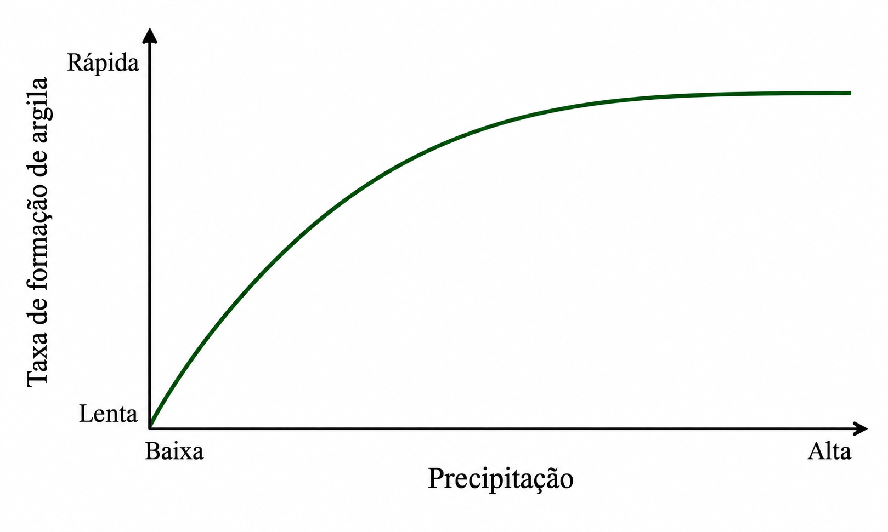{fig-align="center"}

## Fatores de formação do solo
<hr>

[__Clima:__]{.fg style="--col: #e64173"}

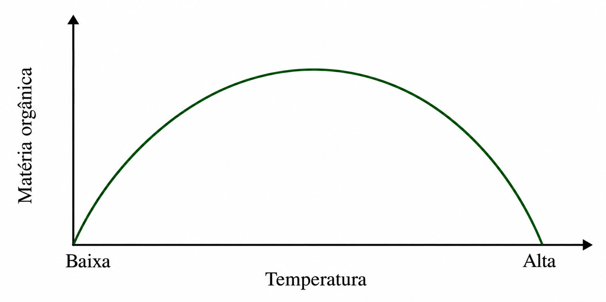{fig-align="center"}

## Fatores de formação do solo
<hr>

[__Organismos:__]{.fg style="--col: #e64173"}

Compreende a flora e a fauna desenvolvida no solo.


::: {.fragment}

Organismos são capazes de adicionar caos ao sistema.

:::


::: {.fragment}

Plantas, animais (homens, outros animais, macro-meso-microfauna do solo) desempenham um importante papel no desenvolvimento e composição do solo.

:::


::: {.fragment}

Em um primeiro momento são os líquens e os musgos que povoam as rochas. Esses extraem elementos por contato direto (alteração lenta das rochas). Quando há um substrato mais desenvolvido, plantas podem colonizar também (absorção e liberação de nutrientes e exsudatos).

:::

## Fatores de formação do solo
<hr>

[__Organismos:__]{.fg style="--col: #e64173"}

::: {layout-nrow=1}

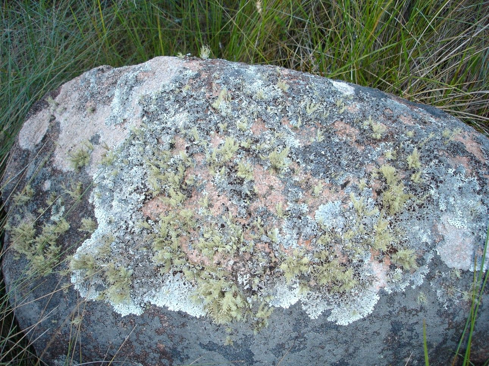{fig-align="center"}

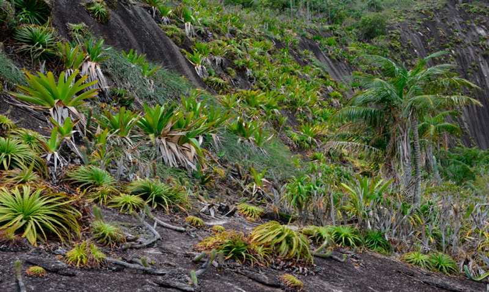{fig-align="center"}

:::

## Fatores de formação do solo
<hr>

[__Organismos:__]{.fg style="--col: #e64173"}

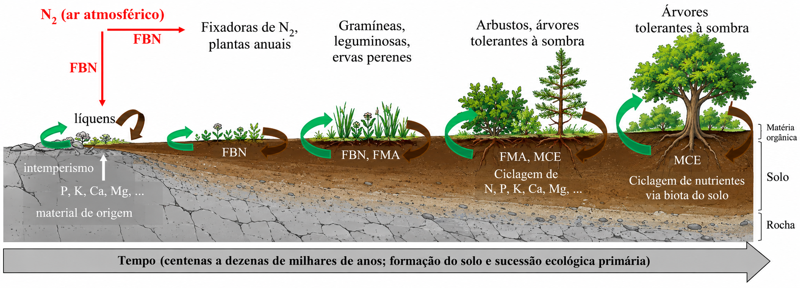{fig-align="center"}

## Fatores de formação do solo
<hr>

[__Organismos:__]{.fg style="--col: #e64173"}

Microrganismos são responsáveis pela decomposição da matéria orgânica.

Já a meso e a macrofauna são atuantes na mistura do solo e na construção de caminhos (poros).

## Fatores de formação do solo
<hr>

[__Organismos:__]{.fg style="--col: #e64173"}

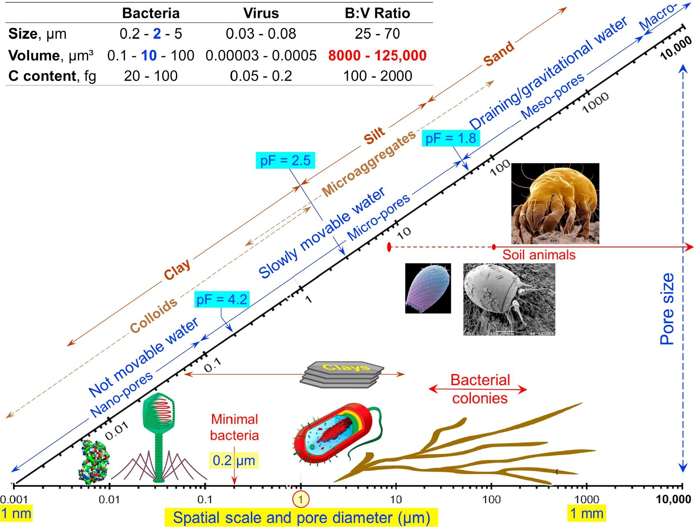{fig-align="center"}


## Fatores de formação do solo
<hr>

[__Organismos:__]{.fg style="--col: #e64173"}

::: {layout-nrow=1}

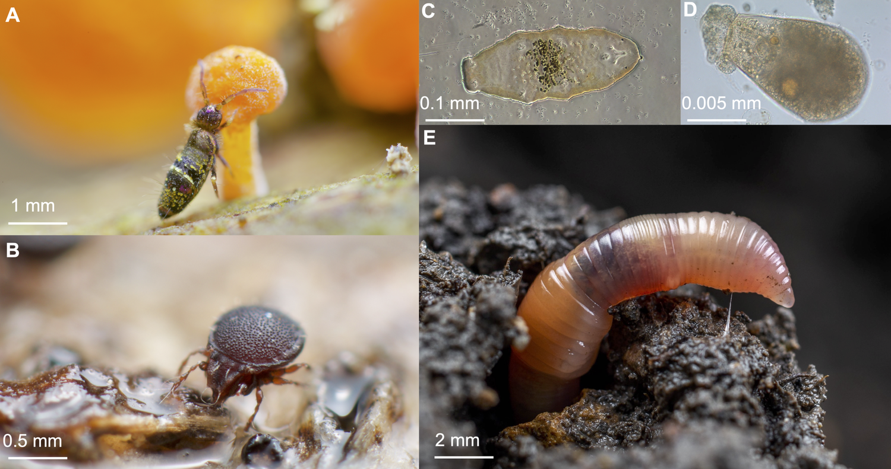{fig-align="center"}

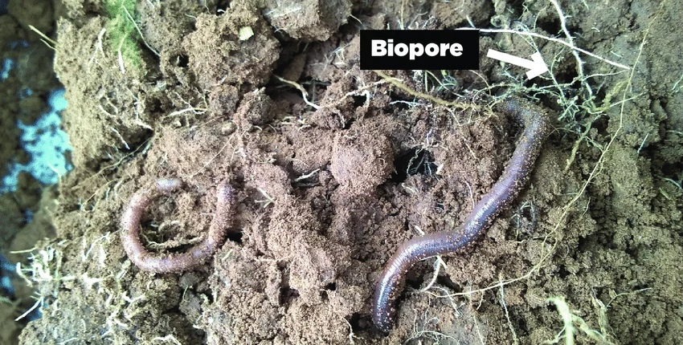{fig-align="center"}

:::

## Fatores de formação do solo
<hr>

[__Organismos:__]{.fg style="--col: #e64173"}

Humanos são organismos que podem compactar, erodir e mudar a vegetação em grande escala de forma rápida.

::: {layout-nrow=1 }

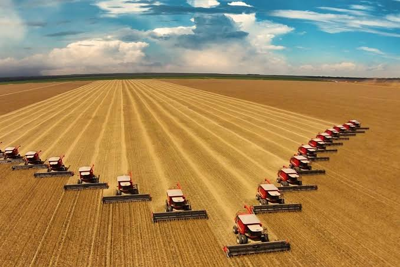{fig-align="center"}

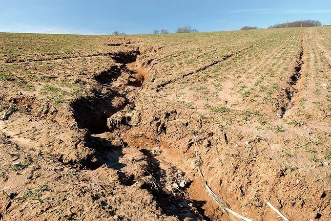{fig-align="center"}

:::

## Fatores de formação do solo
<hr>

[__Organismos:__]{.fg style="--col: #e64173"}

Humanos são organismos que podem compactar, erodir e mudar a vegetação em grande escala de forma rápida.

::: {layout-nrow=1}

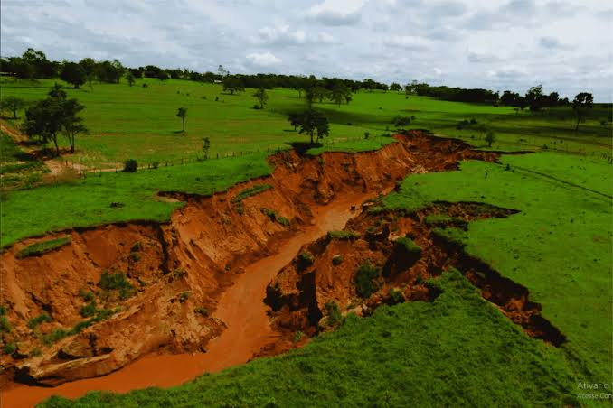{fig-align="center"}

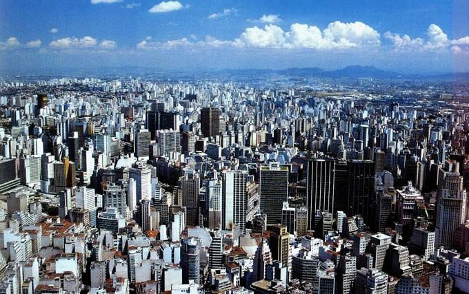{fig-align="center"}

:::


## Fatores de formação do solo
<hr>

[__Relevo:__]{.fg style="--col: #e64173"}

O relevo está relacionado com a distribuição espacial dos solos.


::: {.fragment}

A interferência do relevo na formação do solo é muito diversa.

:::

::: {.fragment}

Efeitos diretos e indiretos (clima e hidrologia)

::: {.incremental}

- Altitude e temperatura (-6ºC a cada 1000 m);
- Acumulação de matéria orgânica;
- Posição do lençol freático;
- Infiltração de água;
- Relação solo-paisagem (direto).

:::

:::

## Fatores de formação do solo
<hr>

[__Relevo:__]{.fg style="--col: #e64173"}

Características do relevo que influem na formação do solo

::: {.incremental}

- Declividade;
- Posição na paisagem;
- Forma do declive;
- Aspecto (N, S, L, O);
- Elevação.

:::

## Fatores de formação do solo
<hr>

[__Relevo:__]{.fg style="--col: #e64173"}

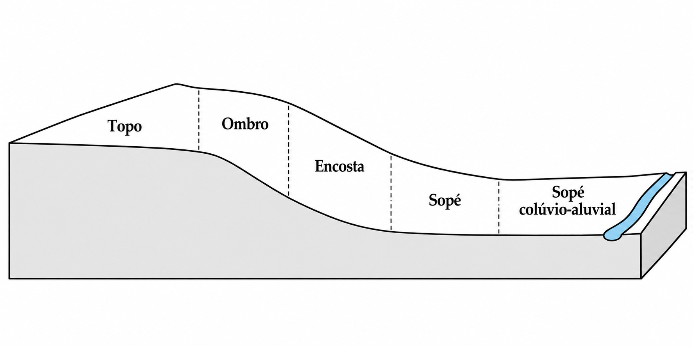{fig-align="center"}

## Fatores de formação do solo
<hr>

[__Relevo:__]{.fg style="--col: #e64173"}

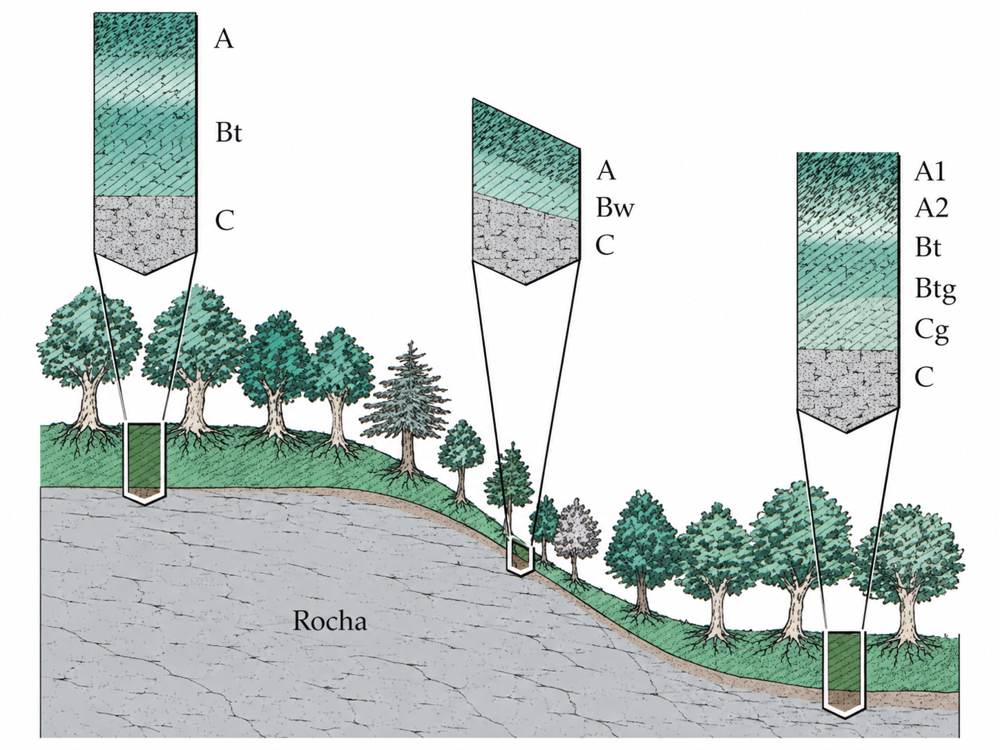{fig-align="center"}


## Fatores de formação do solo
<hr>

[__Relevo:__]{.fg style="--col: #e64173"}

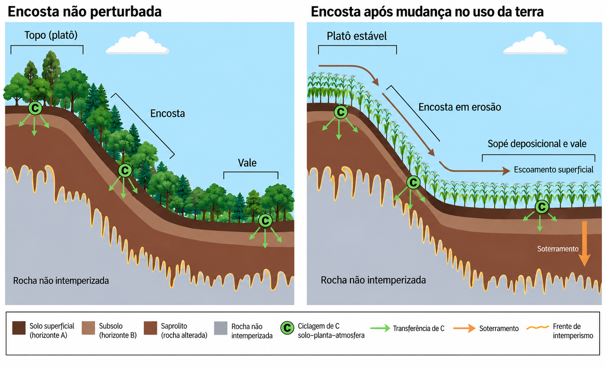{fig-align="center"}

## Fatores de formação do solo
<hr>

[__Relevo:__]{.fg style="--col: #e64173"}

::: {layout-nrow=1}

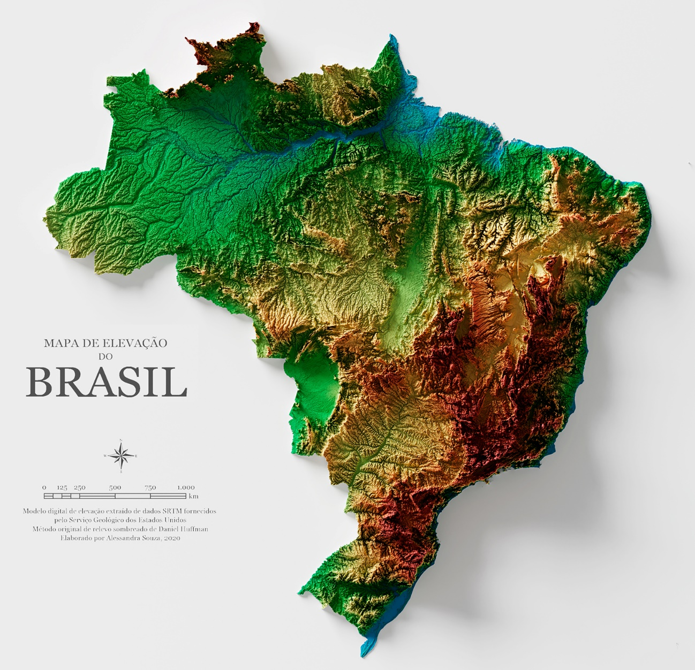{fig-align="center" }

::: {.fragment}

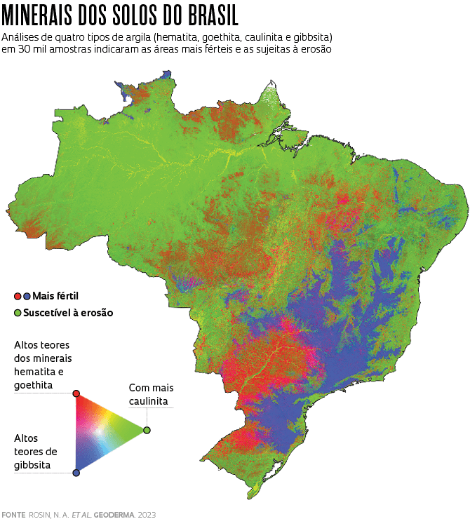{fig-align="center" width="450px"}

:::

:::

## Fatores de formação do solo
<hr>

[__Relevo:__]{.fg style="--col: #e64173"}

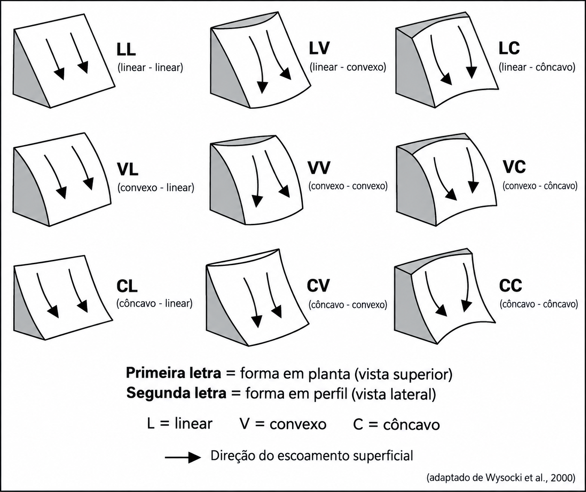{fig-align="center"}


## Fatores de formação do solo
<hr>

[__Tempo:__]{.fg style="--col: #e64173"}

É o fator que define quanto as ações do clima e dos organismos atuaram sobre o material de origem.


::: {.fragment}

Cronossequência

:::


::: {.fragment}

É o único fator que "sempre vai ter ação", independente do solo!

:::

## Fatores de formação do solo
<hr>

[__Tempo:__]{.fg style="--col: #e64173"}

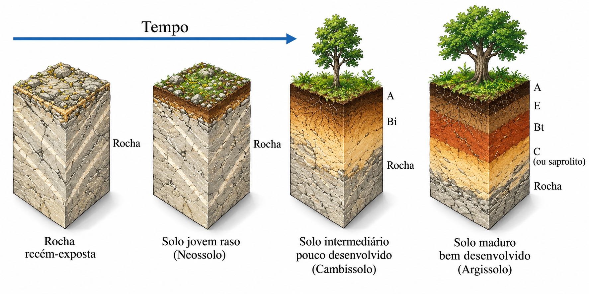{fig-align="center"}

## Fatores de formação do solo
<hr>

[__Tempo:__]{.fg style="--col: #e64173"}

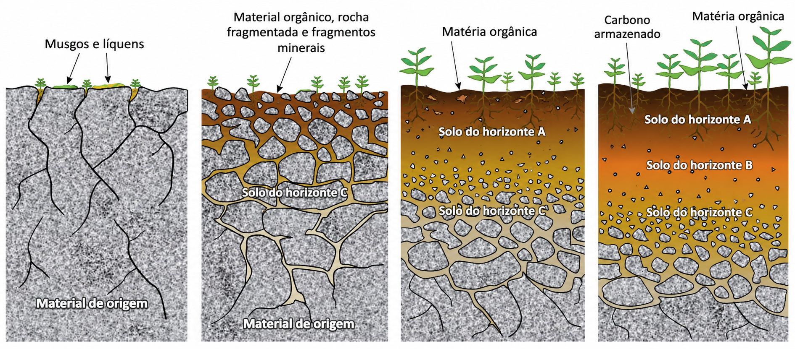{fig-align="center"}

# Processos de formação do solo
<hr>

# Processos pedogenéticos
<hr>

## Processos pedogenéticos
<hr>

A interação entre os fatores de formação do solo (material de origem, clima, organismos, relevo e tempo) desencadeia processos que formam o solo. Esses são chamados processos pedogenéticos.

## Processos pedogenéticos (gerais)
<hr>

::: {.incremental}

- Adição;
- Remoção;
- Transformação;
- Translocação.

:::

## Processos pedogenéticos (gerais)
<hr>

Adição: Entrada de material orgânico ou mineral ao solo e de energia. 

::: {.incremental}

- Em superfície ou em profundidade;
- Ação humana, eólica ou pelo fluxo de água.

:::


::: {.fragment}

Exemplos:

::: {.incremental}

- Matéria orgânica (adubos orgânicos);
- Água;
- Partículas minerais;
  - Calcário, Gesso, Cinza, Poeira;
- Pesticidas e drogas;
- Ascensão de sais por capilaridade.

:::

:::


## Processos pedogenéticos
<hr>


Remoção ou perdas: Materiais removidos do solo pela superfície, subsuperfície ou lateralmente.


::: {.fragment}

Exemplos:

::: {.incremental}

- Perda de partículas minerais ou solo (erosão);
- Perda de água por evapotranspiração;
- Perda de matéria orgânica;
- Queimadas;
- Perda de elementos por lixiviação.

:::


:::

## Processos pedogenéticos
<hr>

Transformação: Modificações químicas e físicas nos constituintes do solo (minerais e orgânicos).


::: {.fragment}

Ocorre no local de formação do solo (_in situ_)

:::


::: {.incremental}

- Destruição dos minerais primários e da rocha (intemperismo);
- Gênese dos minerais secundários;
- Decomposição da MO e síntese de ácidos orgânicos;
- Alteração granulométrica;
- Transformação de resíduos orgânicos em MO.

:::

## Processos pedogenéticos
<hr>

Translocação: Transferência de matéria e energia entre os horizontes e lateralmente no mesmo horizonte. Pode ser ocasionada por ação do homem ou da fauna do solo.

::: {.incremental}

- Eluviação de materiais entre horizontes (argila);
- Movimentação de água no solo (percolação ou ascensão);
- Transporte de materiais dentro do perfil;
  - Bioturbação (por minhocas, cupins, formigas e outros seres).

:::

## Processos pedogenéticos  (gerais)
<hr>

Resumo:

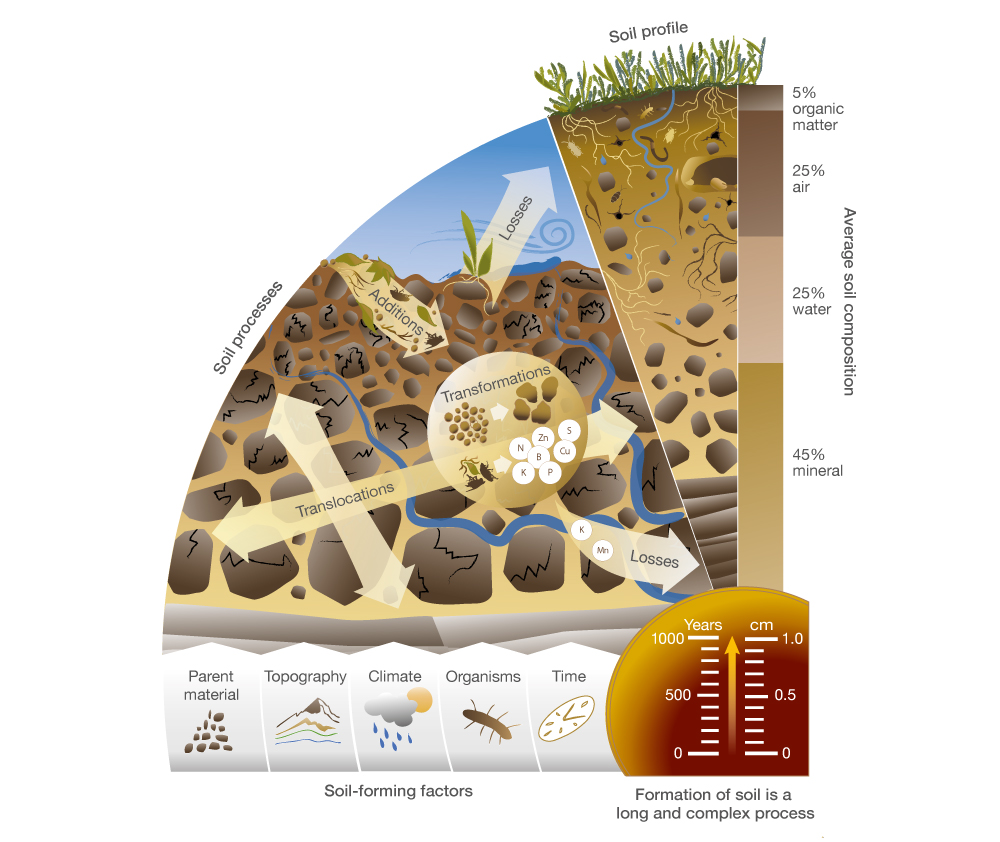{fig-align="center"}


# Processos pedogenéticos específicos
<hr>

## Processos pedogenéticos específicos
<hr>

[__Latolização ou Ferralitização:__]{.fg style="--col: #e64173"}

Ocorre em regiões úmidas com elevada temperatura e precipitação (maior que a evapotranspiração).


::: {.fragment}

Formação de ácido carbônico que mantém o pH do solo acima de 5

:::


::: {.fragment}

Nessa condição o silício é mais solúvel que o Fe e o Al. Isso resulta na remoção do silício e acumulação de Fe e Al.

:::


::: {.fragment}

O ferro (Fe^2+^) que é liberado dos minerais primários é oxidado e precipita em óxido de ferro, como goethita (FeOOH) e hematita (Fe~2~O~3~).

:::

## Processos pedogenéticos específicos
<hr>

[__Latolização ou Ferralitização:__]{.fg style="--col: #e64173"}

É um processo lento e ocorre em solos com vários materiais de origem. Envolve as reações de oxidação e dessilicação e os processos de remoção, translocação e transformação.


::: {.fragment}

Translocação em Argissolos e Nitossolos e remoção em Latossolos

:::

::: {.fragment}

Características dos solos:


::: {.columns}

::: {.column}

::: {.incremental}

- Solos profundos;
- Homogêneos;
- Baixo gradiente textural;

:::

:::

::: {.column}

::: {.incremental}

- Coloração uniforme;
- Baixa saturação de cátions.

:::

:::

:::

:::

## Processos pedogenéticos específicos
<hr>

[__Latolização ou Ferralitização:__]{.fg style="--col: #e64173"}

::: {layout-nrow=1}

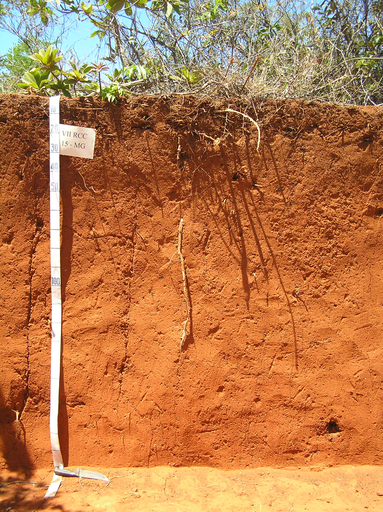{fig-align="center" width="350px"}

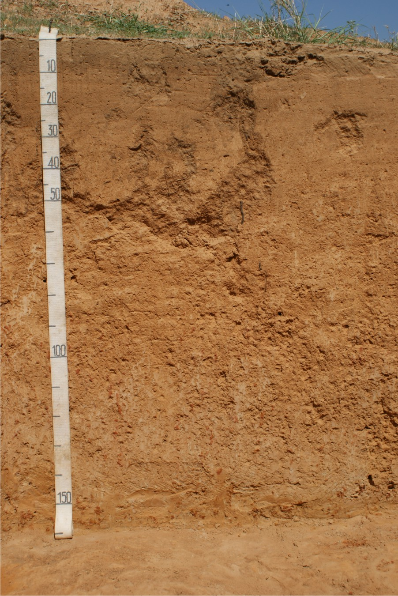{fig-align="center" width="310px"}

:::

## Processos pedogenéticos específicos
<hr>

[__Paludização:__]{.fg style="--col: #e64173"}

É o acúmulo e transformação de material orgânico em um ambiente redutor ou anaeróbico, onde a degradação da matéria orgânica é desfavorável.

::: {.fragment}

Observado em ambientes de baixa drenagem: restingas litorâneas ou em regiões onde o lençol freático é próximo à superfície. Também pode ser encontrada em locais de alta altitude, onde a degradação da matéria orgânica é reduzida devido à baixa temperatura.

:::

::: {.fragment}

Características dos solos:

::: {.incremental}

- Acúmulo de material orgânico;
- Cores escurecidas;

:::

:::

## Processos pedogenéticos específicos
<hr>

[__Paludização:__]{.fg style="--col: #e64173"}

::: {layout-nrow=1}

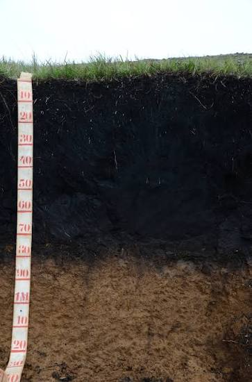{fig-align="center" width="310px"}

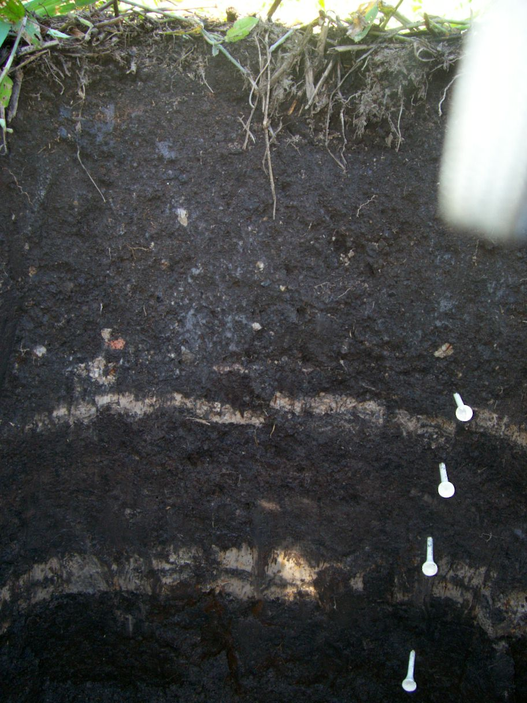{fig-align="center" width="340px"}

:::

## Processos pedogenéticos específicos
<hr>

[__Podzolização:__]{.fg style="--col: #e64173"}

É a iluviação de material orgânico humificado e sesquióxidos de Fe e Al. 


::: {.fragment}

Geralmente é observado em ambiente sob relevo plano com material de origem arenoso, formado por sedimentos quartzosos.

:::


::: {.fragment}

A drenagem do ambiente é imperfeita e o clima é quente e úmido.

Isso permite a lixiviação dos sais solúveis e a mobilização dos complexos organometálicos.

:::

## Processos pedogenéticos específicos
<hr>

[__Podzolização:__]{.fg style="--col: #e64173"}

Espodossolo

::: {layout-nrow=1}

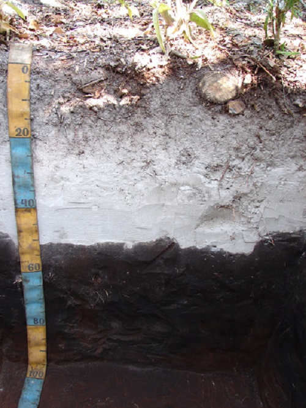{fig-align="center" width="310px"}

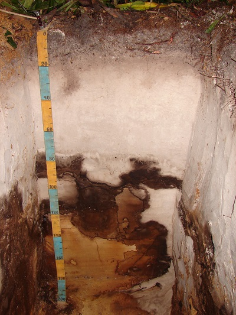{fig-align="center" width="310px"}

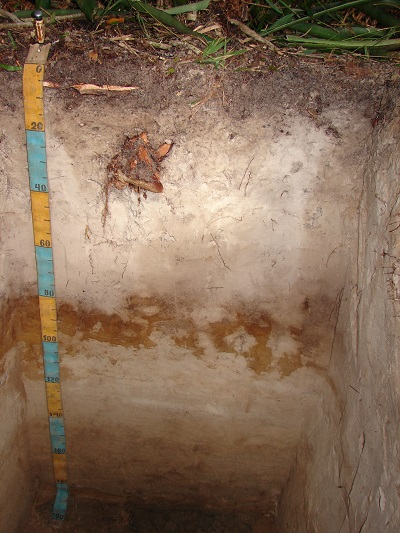{fig-align="center" width="340px"}

:::

## Processos pedogenéticos específicos
<hr>

[__Gleização:__]{.fg style="--col: #e64173"}

Processo de ambientes hidromórficos ou redoximórficos (saturação hídrica sazonal ou permanente).

::: {.fragment}

Processo marcado pelas reações de redução-oxidação e por processos de perdas, transformações e translocações (mosqueados).

:::

::: {.fragment}

Ambientes com predomínio de organismos anaeróbicos que decompõem a matéria orgânica e reduzem os metais (Fe^3+^, Mn^3+^ e Mn^4+^).

:::

## Processos pedogenéticos específicos
<hr>

[__Gleização:__]{.fg style="--col: #e64173"}

Reações de redução

::: {.incremental}

- $0{,}5\,O_2 + 2\,H^+ + 2\,e^- \rightarrow H_2O$

- $NO_3^- + 6\,H^+ + 5\,e^- \rightarrow 0{,}5\,N_2 + 3\,H_2O$

- $MnO_2 + 4\,H^+ + 2\,e^- \rightarrow Mn^{2+} + H_2O$

- $Fe(OH)_3 + 3\,H^+ + e^- \rightarrow Fe^{2+} + 3\,H_2O$

- $0{,}5\,SO_4^{2-} + 5\,H^+ + 4\,e^- \rightarrow
0{,}5\,H_2S + 0{,}5\,H_2O$

- $0{,}5\,CO_2 + 4\,H^+ + 4\,e^- \rightarrow
0{,}5\,CH_4 + H_2O$

:::

## Processos pedogenéticos específicos
<hr>

[__Gleização:__]{.fg style="--col: #e64173"}

Gleissolo

::: {layout-nrow=1}

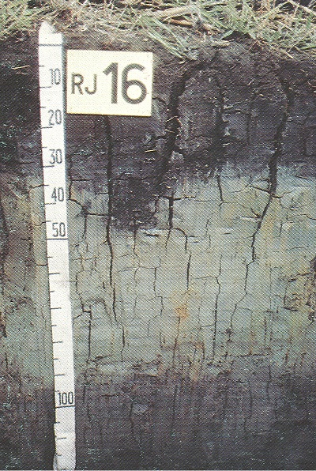{fig-align="center" width="310px"}

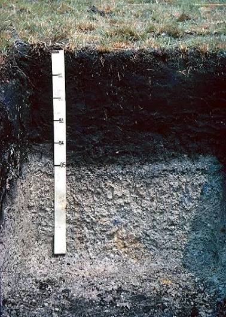{fig-align="center" width="310px"}

:::

## Processos pedogenéticos específicos
<hr>

[__Ferrólise:__]{.fg style="--col: #e64173"}

Caracterizado pela dissolução do ferro (em geral de óxidos) por meio de oxirredução, hidrólise, acidólise e dessilicação.

Duas etapas


::: {.fragment}

Em ambientes de redução (sem oxigênio) o ferro é reduzido e desloca outros cátions (Ca e Mg) dos sítios de troca.

:::


::: {.fragment}

Após a aeração, o Fe^2+^ é oxidado, hidrolisado e precipita na forma de óxido de ferro (Fe^3+^).

:::

## Processos pedogenéticos específicos
<hr>

[__Ferrólise:__]{.fg style="--col: #e64173"}

::: {layout-nrow=1}

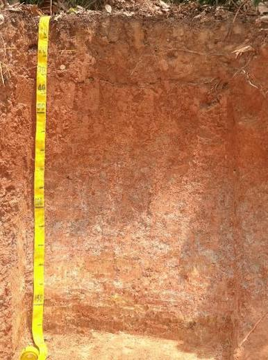{fig-align="center" width="340px"}

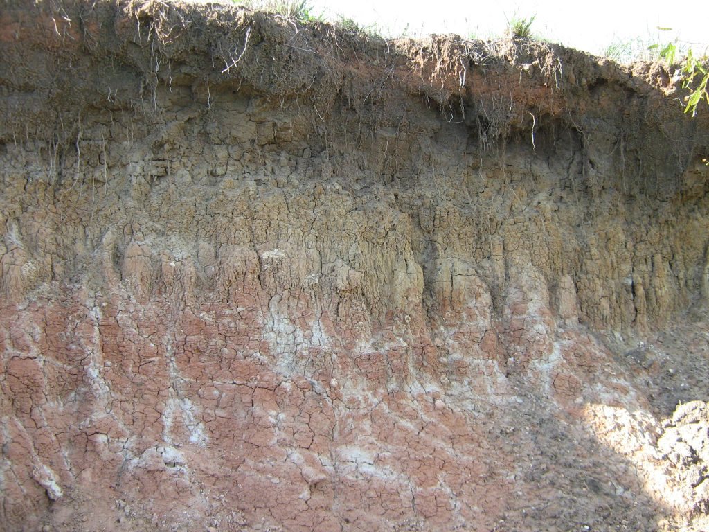{fig-align="center"}

:::

## Processos pedogenéticos específicos
<hr>

[__Melanização:__]{.fg style="--col: #e64173"}

Processo de escurecimento do solo.

::: {.incremental}

- Adição de matéria orgânica e/ou húmus;
- Translocação de matéria orgânica.

:::

::: {.fragment}

Pode ser observado em solos desenvolvidos de material de origem rico em carbonatos.

:::

## Processos pedogenéticos específicos
<hr>

[__Melanização:__]{.fg style="--col: #e64173"}

::: {layout-nrow=1}

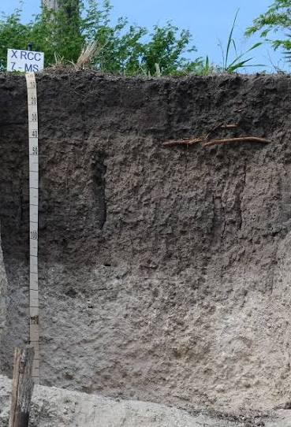{fig-align="center" width="340px"}

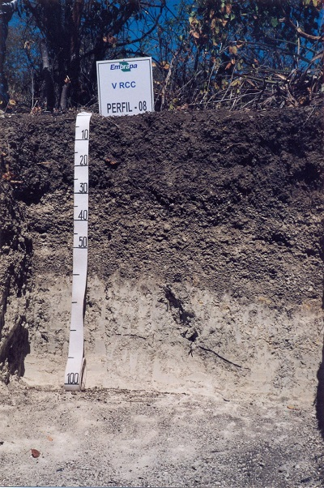{fig-align="center" width="340px"}

:::

## Processos pedogenéticos específicos
<hr>

[__Argiluviação ou Lessivagem:__]{.fg style="--col: #e64173"}

É um processo de transferência (translocação) de coloides minerais (argilossilicatos e óxidos) dos horizontes superficiais A e/ou E para o horizonte B (gradiente textural).

::: {.fragment}

O horizonte que perde material é chamado de eluvial (A ou E). 

::: {.fragment}

**E**luvial, pensar em **e**xportação.

:::

:::

::: {.fragment}

Já o horizonte que ganha material é chamado de iluvial (Bt).


::: {.fragment}

**I**luvial, pensar em **i**mportação.

:::

:::

## Processos pedogenéticos específicos
<hr>

[__Argiluviação ou Lessivagem:__]{.fg style="--col: #e64173"}

::: {layout-nrow=1}

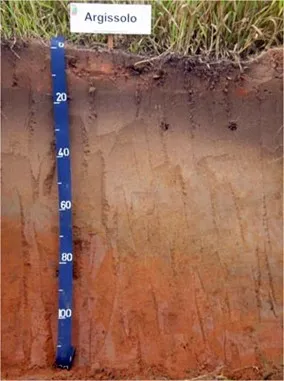{fig-align="center" width="340px"}

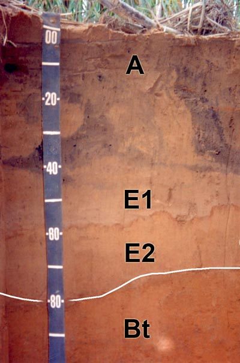{fig-align="center" width="340px"}

:::

## Processos pedogenéticos específicos
<hr>

[__Plintização e Laterização:__]{.fg style="--col: #e64173"}

É uma acumulação (translocação) de óxidos de ferro e da formação (transformação) de plintitas e petroplintitas (antiga "laterita").


::: {.fragment}

A plintita é a mistura entre argila, quartzo e outros minerais, pobre em matéria orgânica e rica em ferro.

:::


::: {.fragment}

Ocorre por ciclos de umedecimento e de secagem do solo. 


::: {.fragment}

Quando se consolida, torna-se petroplintita.

:::

:::

## Processos pedogenéticos específicos
<hr>

[__Plintização e Laterização:__]{.fg style="--col: #e64173"}

::: {.columns}

::: {.column}

Plintita ocorre normalmente na forma de acúmulo de materiais de coloração vermelha, vermelho-amarelada e vermelho-escura.

Difere de mosqueados por serem destacáveis da matriz do solo e por se manterem coesas após imersão em água.

:::

::: {.column}

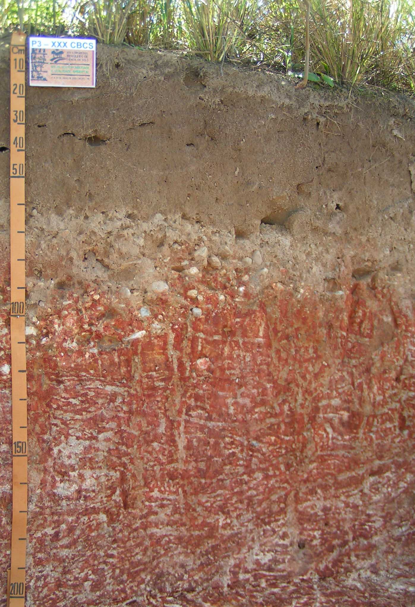{fig-align="center" width="350px"}

:::

:::

## Processos pedogenéticos específicos
<hr>

[__Plintização e Laterização:__]{.fg style="--col: #e64173"}

::: {.columns}

::: {.column}

Já a petroplintita é coesa e oferece resistência maior à quebra.

Pode ser encontrada na forma de lâminas, nódulos, esferas ou formas irregulares.

:::

::: {.column}

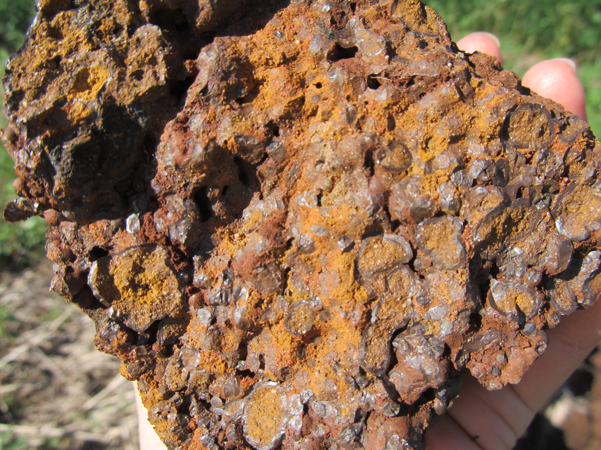{fig-align="center" width="350px"}

:::

:::

## Processos pedogenéticos específicos
<hr>

[__Plintização e Laterização:__]{.fg style="--col: #e64173"}

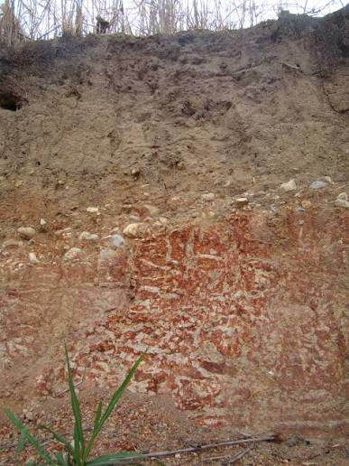{fig-align="center"}

## Processos pedogenéticos específicos
<hr>

[__Vertização:__]{.fg style="--col: #e64173"}

Processo onde o solo é fisicamente revolvido por contração e expansão de argilas (argiloturbação, hidroturbação ou pedoturbação).


::: {.fragment}

É ocasionado pelo retrabalhamento das argilas expansivas do solo. Ciclos de umedecimento e de secagem promovem expansão e contração das argilas 2:1.

:::


::: {.fragment}

Formação de feições morfológicas como o microrrelevo Gilgai e os slickensides.

:::

## Processos pedogenéticos específicos
<hr>

[__Vertização:__]{.fg style="--col: #e64173"}

::: {layout-nrow=1}

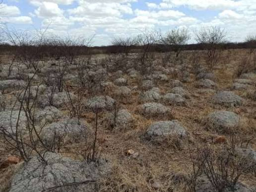{fig-align="center"}

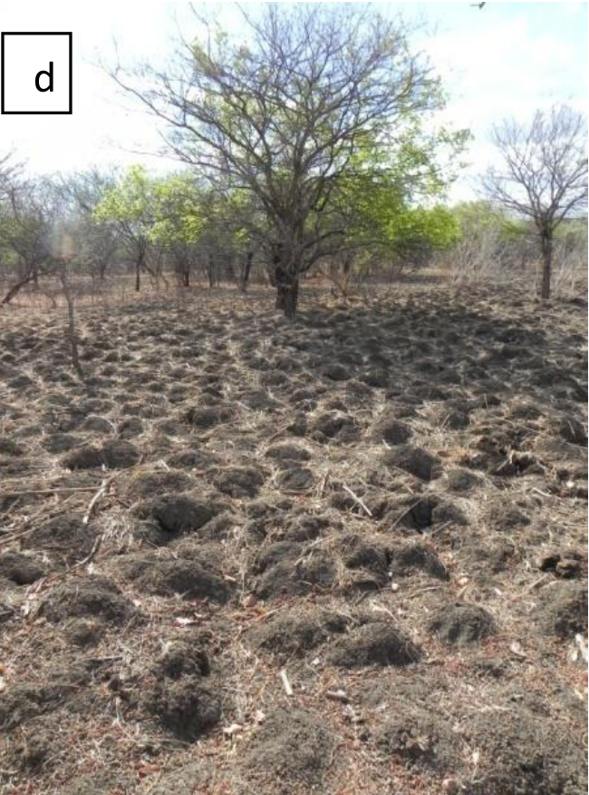{fig-align="center" width="350px"}

:::

## Processos pedogenéticos específicos
<hr>

[__Vertização:__]{.fg style="--col: #e64173"}

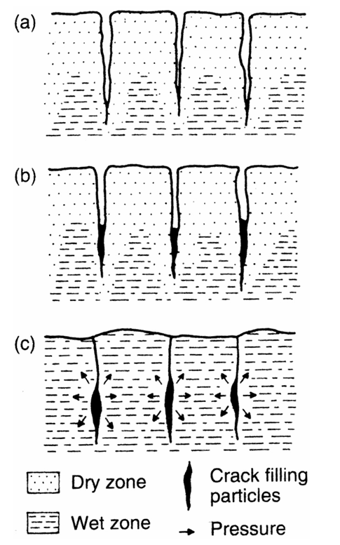{fig-align="center"}

## Processos pedogenéticos específicos
<hr>

[__Vertização:__]{.fg style="--col: #e64173"}

::: {layout-nrow=1}

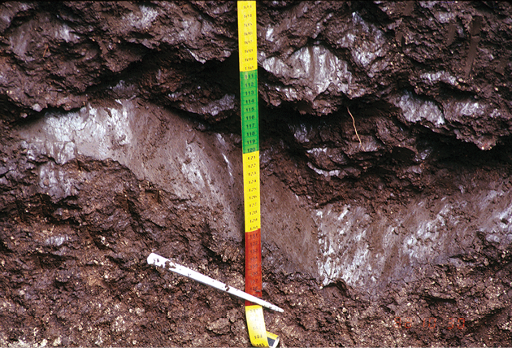{fig-align="center"}

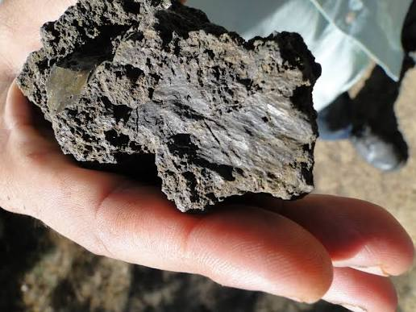{fig-align="center"}

:::

## Processos pedogenéticos específicos
<hr>

[__Vertização:__]{.fg style="--col: #e64173"}

::: {layout-nrow=1}

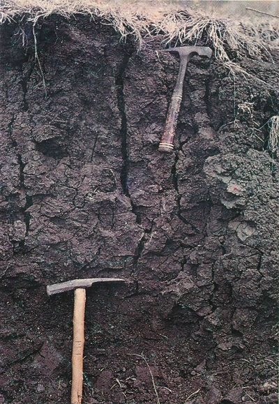{fig-align="center" width="350px"}

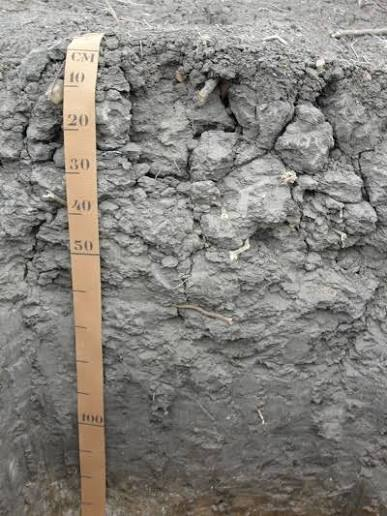{fig-align="center"}

:::

## Processos pedogenéticos específicos
<hr>

[__Sulfidização e Sulfurização (Tiomorfismo):__]{.fg style="--col: #e64173"}

Acúmulo de sulfetos nos solos através de processos de translocação e transformação associados às reações de oxirredução, em que o principal produto formado é a pirita.


::: {.fragment}

Ocorre em locais de baixa disponibilidade de oxigênio.

:::


::: {.fragment}

Bactérias utilizam outros elementos como receptores de elétrons na oxidação da matéria orgânica do solo, como sulfato e óxidos de ferro. Esses são reduzidos a sulfitos e Fe^2+^.

:::


::: {.fragment}

Fe~2~O~3~ + 4SO~4~^2-^ + 8CH~2~O + 1/2O~2~ = 2FeS~2~ + 8HCO~3~^-^ + 4H~2~O

:::

## Processos pedogenéticos específicos
<hr>

[__Sulfidização e Sulfurização (Tiomorfismo):__]{.fg style="--col: #e64173"}

A sulfurização é a oxidação de materiais sulfídricos, como a pirita.


::: {.fragment}

Isso eleva a concentração de Fe^2+^, SO~4~^2-^ e H^+^ na solução do solo.

:::


::: {.fragment}

Em situações extremas (alta oxidação), Fe^2+^ passa para a forma de Fe^3+^, com liberação de H^+^ e formação de H~2~SO~4~, o que leva a uma acidificação extrema do solo.

:::

## Processos pedogenéticos específicos
<hr>

[__Sodificação e Solodização:__]{.fg style="--col: #e64173"}

A sodificação está relacionada com a saturação do complexo de troca do solo pelo íon Na^+^, devido ao uso de água de irrigação com altos teores de sódio e/ou devido à ocorrência natural em ambientes litorâneos ou áridos e semiáridos.


::: {.fragment}

Enquanto os sais solúveis estiverem presentes, o pH é mantido abaixo de 8,5 e o efeito floculante dos sais mantém a estrutura e a permeabilidade do solo.

:::


::: {.fragment}

Quando há lixiviação e permanece apenas o Na^+^, o pH sobe para 8,5 a 10, promovendo a dispersão e a translocação de argila.

:::

## Processos pedogenéticos específicos
<hr>

[__Sodificação e Solodização:__]{.fg style="--col: #e64173"}

Solos com sodificação apresentam porcentagem de sódio trocável (PST) >= 15% e condutividade elétrica < 4,0 dS m^-1^.

::: {.fragment}

O processo de solodização está relacionado com o aumento da lixiviação de sódio, aumentando a dispersão e a migração das argilas (pode originar horizonte Bt).

:::


::: {.fragment}

PST: entre 6 e 15%

:::

## Processos pedogenéticos específicos
<hr>

[__Salinização:__]{.fg style="--col: #e64173"}

Processo em que ocorre a acumulação de sais por evaporação no horizonte superficial ou na superfície do solo.


::: {.fragment}

Combinação de fatores climáticos (precipitação e temperatura), edáficos (baixa lixiviação e presença de camadas impermeáveis) e de manejo do solo (irrigação com águas salinas ou excesso de agroquímicos).

:::


::: {.fragment}

Pode ser de origem natural, pelo intemperismo, principalmente em regiões litorâneas e costeiras.

:::


::: {.fragment}

Ou de origem artificial, devido ao manejo.

:::

## Processos pedogenéticos específicos
<hr>

[__Salinização:__]{.fg style="--col: #e64173"}

O excesso de sal no solo não é tóxico, mutagênico ou carcinogênico, mas afeta as propriedades químicas e físicas do solo.


::: {.incremental}

- Substituição de Ca por Na na CTC;
- Dispersão das partículas;
- Estabilidade de agregados;
- Porosidade;
- Drenagem;

:::

## Processos pedogenéticos específicos
<hr>

[__Salinização:__]{.fg style="--col: #e64173"}

No Sistema Brasileiro de Classificação de Solos:

sálico: CE >= 7,0 dS m^-1^

salino: 4,0 <= CE < 7,0 dS m^-1^


## Processos pedogenéticos específicos
<hr>

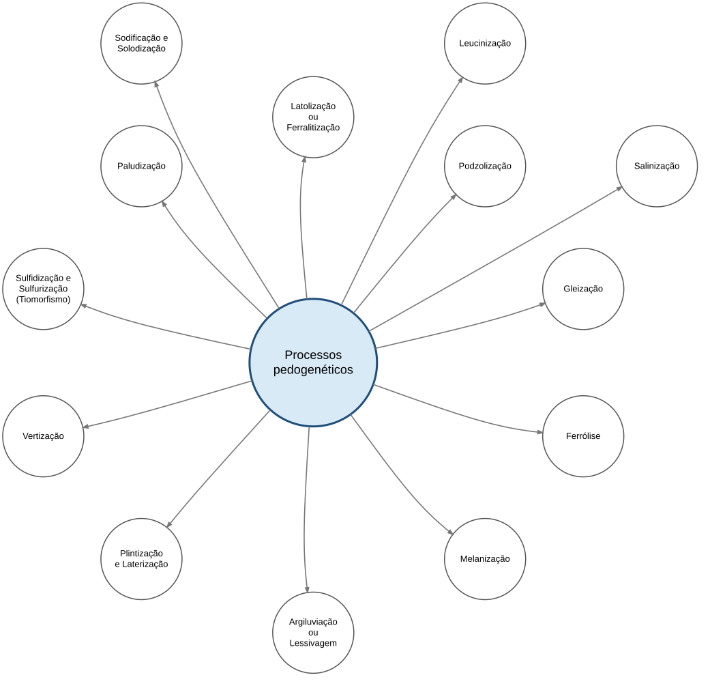{fig-align="center"}

# Fim!
<hr>